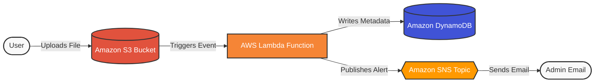

# AWS Serverless Event-Driven Data Pipeline

## Overview

This project is a production-ready, event-driven architecture built on AWS. It automates data processing by triggering a serverless compute function whenever a new file is uploaded to cloud storage, automatically logging the metadata to a NoSQL database and dispatching an email alert.

The entire infrastructure is provisioned as code (IaC) using Terraform, ensuring secure, repeatable, and automated deployments.

## 🏗️ Architecture



**The Workflow:**

1. **Amazon S3:** Acts as the trigger. A user uploads a file (e.g., JSON, CSV).
2. **AWS Lambda (Python/Boto3):** S3 automatically invokes the Lambda function. The script extracts the file metadata.
3. **Amazon DynamoDB:** Lambda writes a permanent record of the file upload (filename, bucket, timestamp) into a NoSQL table.
4. **Amazon SNS:** Lambda publishes a message to an SNS topic, instantly emailing an administrator that the file was successfully processed.

## Tech Stack

- **Cloud Provider:** AWS
- **Infrastructure as Code:** Terraform
- **Compute:** AWS Lambda (Python 3.12, Boto3)
- **Storage & Database:** Amazon S3, Amazon DynamoDB
- **Messaging:** Amazon SNS
- **Security:** IAM (Least Privilege Execution Roles)

## ⚙️Prerequisites

- An AWS Account (Free Tier covers all services used).
- [AWS CLI](https://aws.amazon.com/cli/) installed and configured with your credentials.
- [Terraform](https://www.terraform.io/downloads) installed.

```

```
